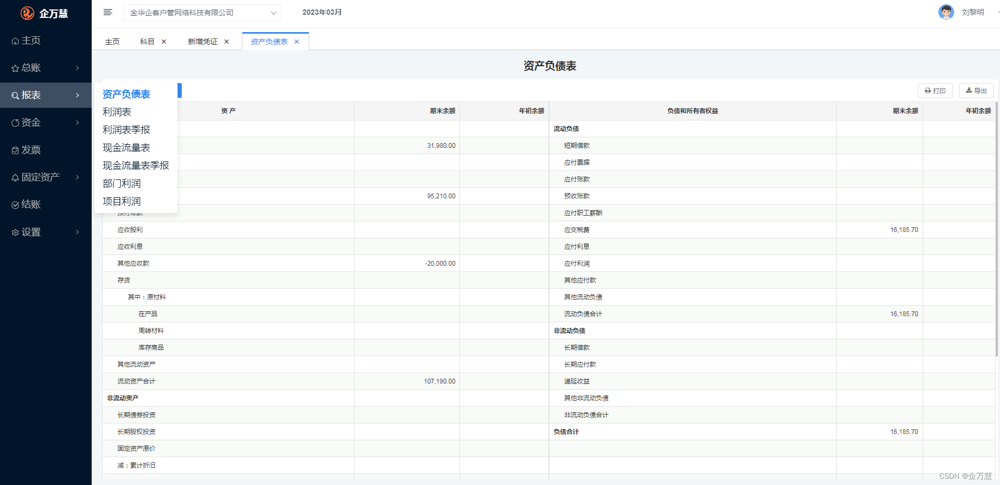
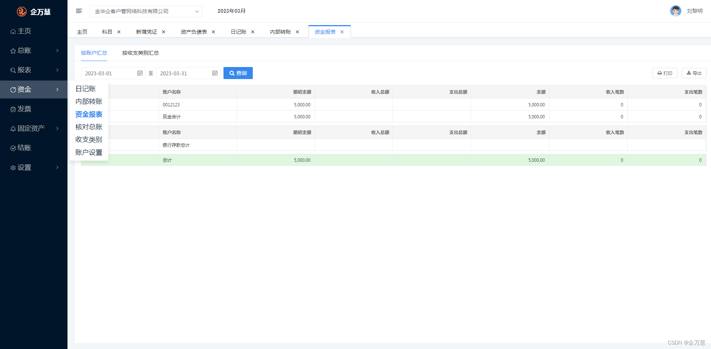
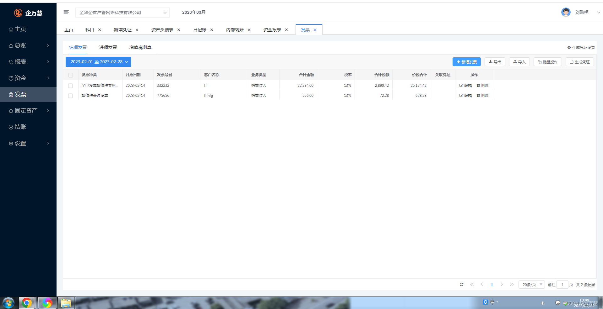
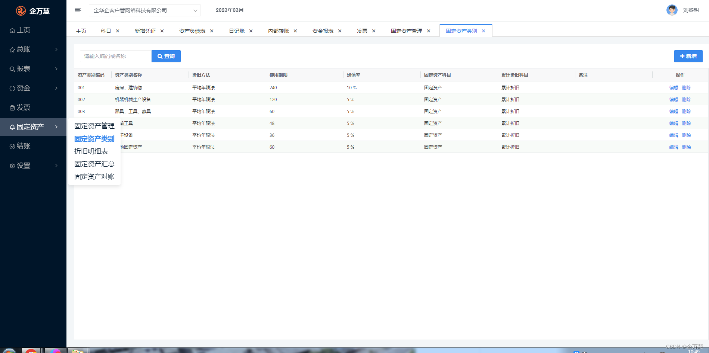
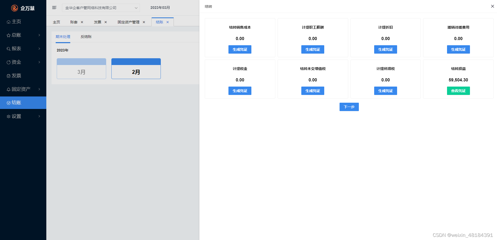

# 财务软件源码商业版本
源码加微信

#### 介绍
财务软件源码 -与记账财务软件源码 电话18329078628

#### 商业版演示地址
软件架构说明
http://ycs.qwh365.com/
账号：18329078628 / 密码：123456
#### 介绍
目前主要包括以下模块，凭证 账簿 报表 结账 设置
技术选型
1. 前端主要是vue3和heyui

2. 后端主要是springboot和一些辅助框架
spring boot 2.7
querydsl

blazebit

sa-token

hutool

sqltoy

aviator

heyui

vue3

#### 开发环境

数据库支持：目前仅提供MySql数据库的支持，
开发环境：Java、IDEA 、Gradle 、Git 、NODE.JS
4、版权说明
可以二开，可用于商业销售

#### 样式
#### 一.总账
新增凭证

#### 二.报表

#### 三.资金.内部资金

#### 四.发票。导入功能

#### 四.五. 固定资产

#### 六.结账
